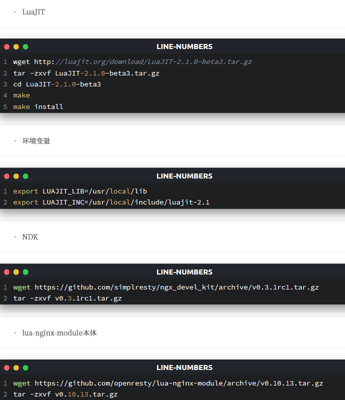
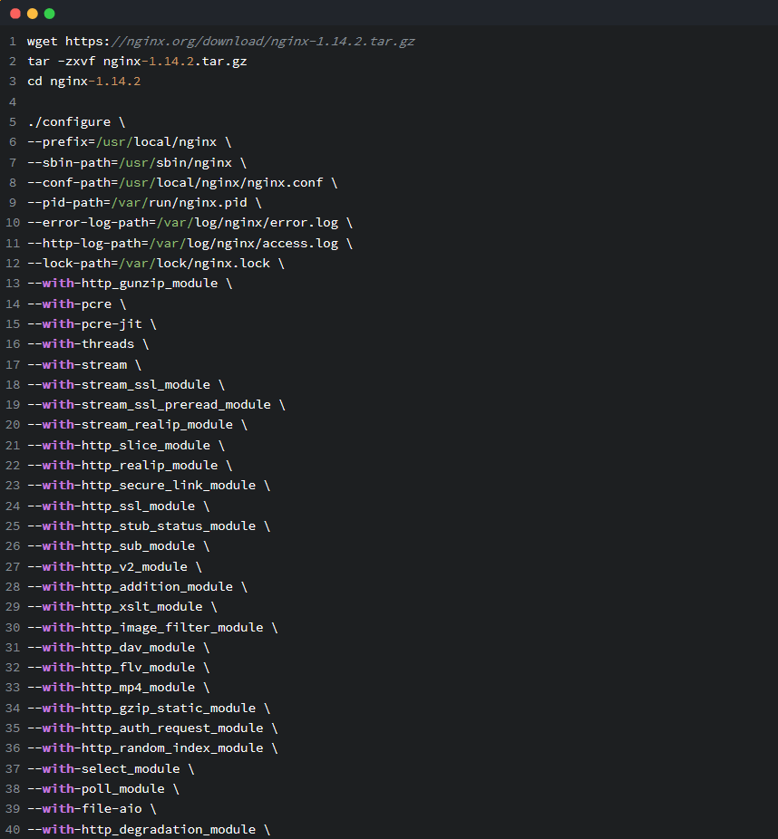
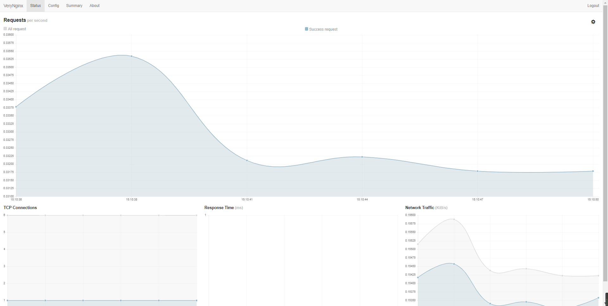

# 第五章 Web服务器实验报告
## 一、安装
### 1.VeryNginx目前支持OpenResty(自动安装)和Nginx(需手动编译)， 先安装VeryNginx
```
git clone https://github.com/alexazhou/VeryNginx.git
cd VeryNginx
python install.py install verynginx
```
### 2.编译安装所需的依赖项
```
yum groupinstall "Development Tools" -y
yum install pcre pcre-devel zlib zlib-devel libxml2 libxml2-devel libxslt-devel gd gd-devel libatomic_ops-devel -y
```

### Nfinx
```
wget https://nginx.org/download/nginx-1.14.2.tar.gz
tar -zxvf nginx-1.14.2.tar.gz
cd nginx-1.14.2 
./configure \
--prefix=/usr/local/nginx \
--sbin-path=/usr/sbin/nginx \
--conf-path=/usr/local/nginx/nginx.conf \
--pid-path=/var/run/nginx.pid \
--error-log-path=/var/log/nginx/error.log \
--http-log-path=/var/log/nginx/access.log \
--lock-path=/var/lock/nginx.lock \
--with-http_gunzip_module \
--with-pcre \
--with-pcre-jit \
--with-threads \
--with-stream \
--with-stream_ssl_module \
--with-stream_ssl_preread_module \
--with-stream_realip_module \
--with-http_slice_module \
--with-http_realip_module \
--with-http_secure_link_module \
--with-http_ssl_module \
--with-http_stub_status_module \
--with-http_sub_module \
--with-http_v2_module \
--with-http_addition_module \
--with-http_xslt_module \
--with-http_image_filter_module \
--with-http_dav_module \
--with-http_flv_module \
--with-http_mp4_module \
--with-http_gzip_static_module \
--with-http_auth_request_module \
--with-http_random_index_module \
--with-select_module \
--with-poll_module \
--with-file-aio \
--with-http_degradation_module \
--with-libatomic \
--http-client-body-temp-path=/var/tmp/nginx/client_body \
--http-proxy-temp-path=/var/tmp/nginx/proxy \
--http-fastcgi-temp-path=/var/tmp/nginx/fastcgi \
--http-uwsgi-temp-path=/var/tmp/nginx/uwsgi \
--http-scgi-temp-path=/var/tmp/nginx/scgi \
--with-ld-opt=-Wl,-rpath,/usr/local/lib \
--add-module=../ngx_brotli \
--add-module=../ngx_devel_kit-0.3.1rc1 \
--add-module=../lua-nginx-module-0.10.13 \
--with-openssl=../openssl-1.1.1a 
Make
make install
```

### 3.让VeryNginx跑起来
### 为了让VeryNginx跑起来，需要在nginx.conf中引入以下内容
### Http块外
```
include /opt/verynginx/verynginx/nginx_conf/in_external.conf;
```
### Http块内
```
include /opt/verynginx/verynginx/nginx_conf/in_http_block.conf;
```
### Server块内，插入到需要启用的站点配置文件
```
include /opt/verynginx/verynginx/nginx_conf/in_server_block.conf;
```
## 二、开始使用VeryNginx
### VeryNginx 启动后，可以通过浏览器访问管理面板来查看状态以及进行配置。
### 管理面板地址为 http://"Your Domain"/verynginx/index.html
### 默认用户名和密码是 verynginx / verynginx。
### 登录之后就可以查看状态，并对配置进行修改了。修改配置后，点击保存才会生效。
